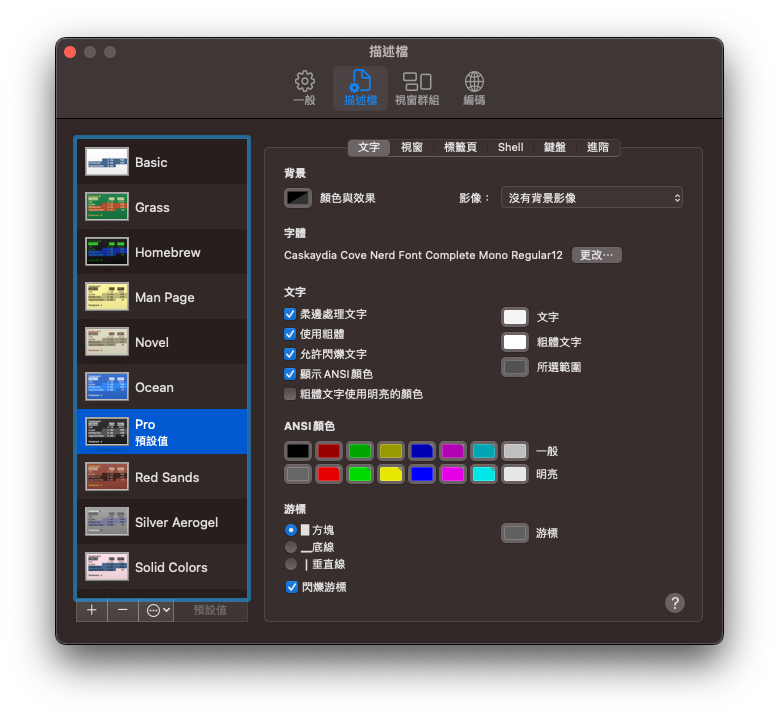
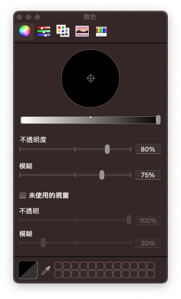

# DotFiles

## 安裝步驟

### 第一步

將dotfiles設定檔還原，並於家目錄建立對應的軟連結。若當下家目錄有對應的軟連結存在，會取代；若有對應的檔案、目錄或Oh-My-Zsh主題存在，會備份至 `~/.dotfiles_backup`。

```bash
cd ~
git clone https://github.com/linziyou0601/dotfiles.git .dotfiles
cd .dotfiles
rake install
```

### 第二步

設定Terminal




---

## 環境

### python

miniforge

* 列出環境：`conda env list`

java

* 環境變數：`.zprofile`設定`JAVA_HOME`
* 列出環境：`/usr/libexec/java_home -V`

Node

* 環境變數：`.zprofile`設定`NVM_DIR`
* 列出環境：`nvm ls`

Flutter

* 環境變數：`.zprofile`設定`PATH`
* 列出環境：`fvm list`

---

## 其他說明

### 字型偏好

* 終端機：`Caskaydia Cove Nerd Font Mono`
* 編輯器：`JetBrains Mono`

### Rakefile

以ruby撰寫執行，設定安裝時要處理的步驟

### Brewfile

還原套件時，會略過已存在的

* 建立：`brew bundle dump --describe --force`
* 還原：`brew bundle --file ~/.dotfiles/Brewfile`

### conda-env

* 目錄：`/opt/homebrew/Caskroom/miniforge/base/envs`

### ssh keys

* debug.keystore：`~/.android/debug.keystore`
* id_rsa：`~/.ssh/id_rsa`
* id_rsa.pub：`~/.ssh/id_rsa.pub`
* 私人金鑰：`~/.ssh/<目錄>`

### hosts

目錄：`/private/etc/hosts`
